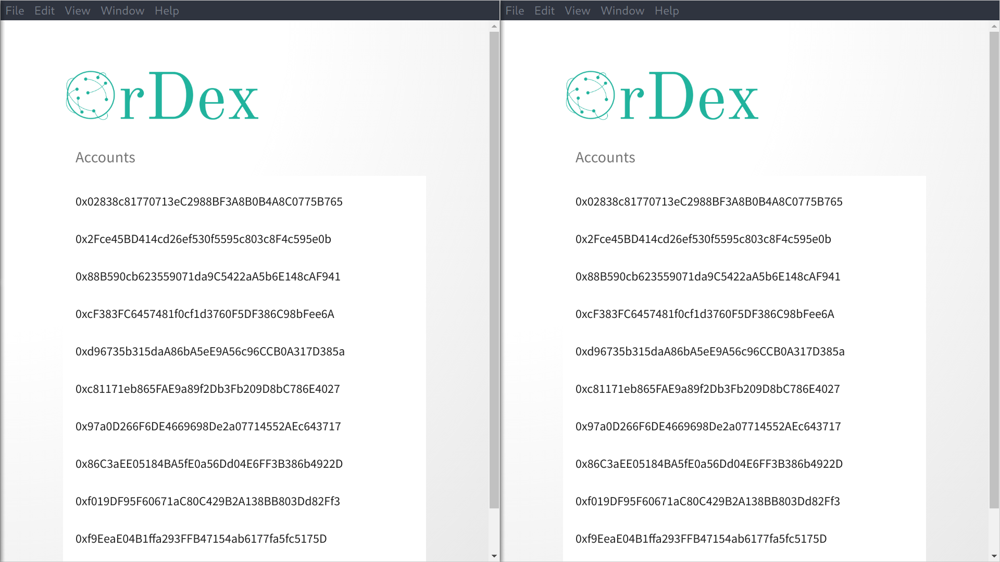

OrDex is a decentralized exchange for ERC20 tokens.
It uses [Orbit DB][orbit-db], which is backed by [IPFS][ipfs],
to manage its order book.

The following animation is the OrDex desktop client performing
an exchange between to parties.

This repository contains the different parts of the OrDex project.

* [backend](./backend):
  Backend server providing a set of APIs for the clients
  and managing the order book.
* [contracts](./contracts): Smart contracts used to
  perform the token exchanges
* [frontend](./frontend): Desktop application built on
  top of [Electron][electron] and [VueJS][vuejs] providing
  an easy to use interface to OrDex

[orbit-db]: https://github.com/orbitdb/orbit-db
[ipfs]: https://ipfs.io/
[electron]: https://electronjs.org/
[vuejs]: https://vuejs.org/
