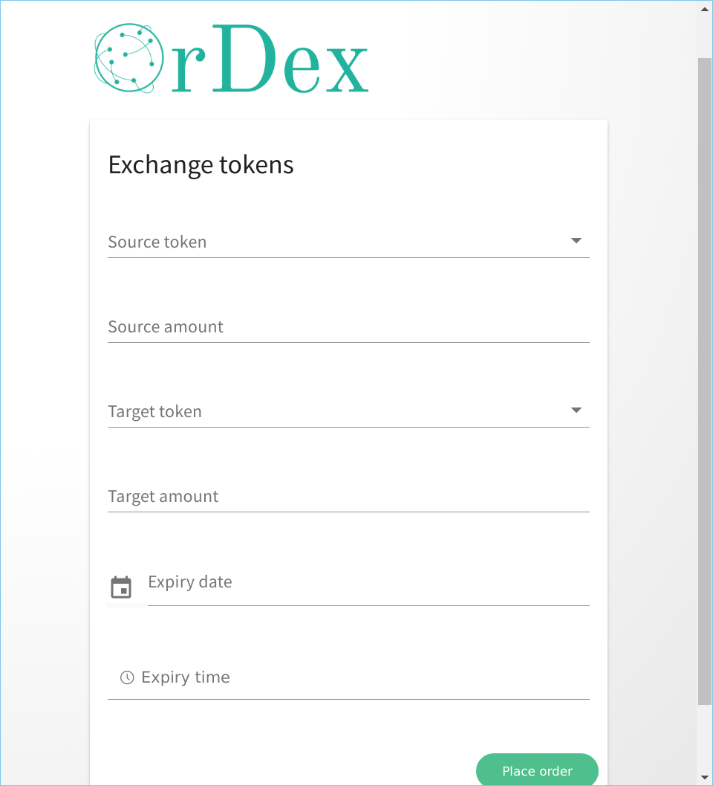

# OrDex Desktop client

The desktop client of OrDex is developed using [Electron][electron] and [VueJS][vuejs].

Below is a screenshot of the order page.



#### Build Setup

``` bash
# install dependencies
npm install

# serve with hot reload at localhost:9080
npm run dev

# build electron application for production
npm run build

# run unit & end-to-end tests
npm test

# lint all JS/Vue component files in `src/`
npm run lint
```

---

The project was generated with [electron-vue](https://github.com/SimulatedGREG/electron-vue), see its documentation
for more information.

[electron]: https://electronjs.org/
[vuejs]: https://vuejs.org/